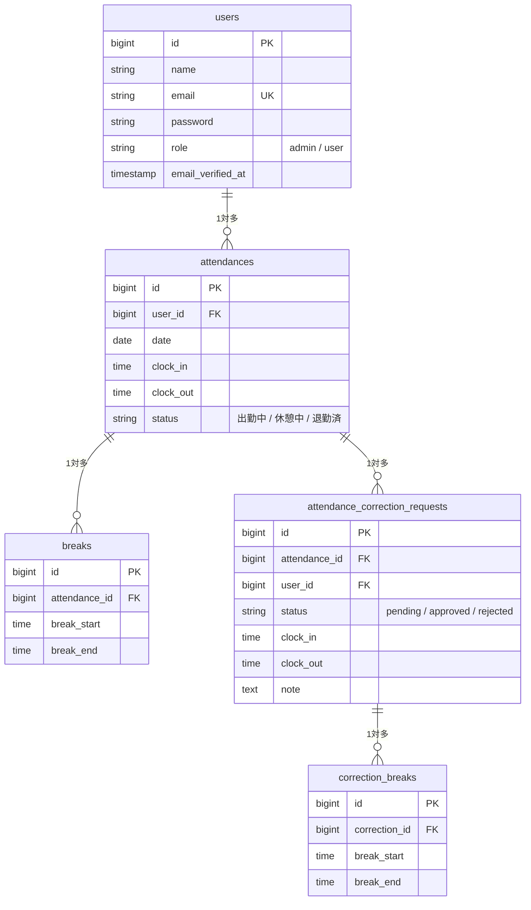

# 勤怠管理システム (Attendance App)

CT（COACHTECH）の勤怠管理システムです。出退勤の打刻、休憩管理、勤怠修正申請、および管理者による承認・スタッフ管理機能を提供します。

## 環境構築

### Docker ビルド

```bash
# リポジトリのクローン
git clone [repository_url] .

# Docker コンテナのビルド・起動
docker compose up -d --build

# PHPコンテナ内へ
docker compose exec php bash

# 依存関係のインストール
composer install

# 環境設定ファイルの作成
cp .env.example .env

# アプリケーションキーの生成
php artisan key:generate

# マイグレーションとシーディング（ダミーデータ投入）を実行
php artisan migrate --seed

# ストレージ用シンボリックリンクの作成
php artisan storage:link
```

## 開発環境 URL

- **打刻画面（トップ）**: [http://localhost/](http://localhost/)
- **管理者ログイン**: [http://localhost/admin/login](http://localhost/admin/login)
- **メールプレビュー (Mailpit)**: [http://localhost:8025/](http://localhost:8025/)

## ログイン情報

採点および動作確認用のテストアカウントは以下の通りです。

### 管理者ユーザー
- **メールアドレス**: `admin@example.com`
- **パスワード**: `password`

### 一般ユーザー
- **メールアドレス**: `user@example.com`
- **パスワード**: `password`

## 使用技術
- PHP 8.2
- Laravel 10
- MySQL 8.0
- Fortify (認証基盤)
- CSS (Vanilla CSS / プレミアムデザイン)

## ER図



## 各種テストの実行方法

```bash
# 全テスト（Feature/Unit）の実行
php artisan test
```
